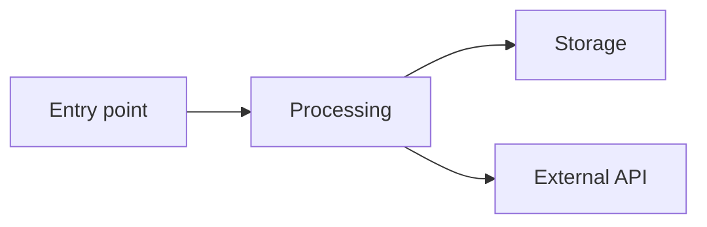
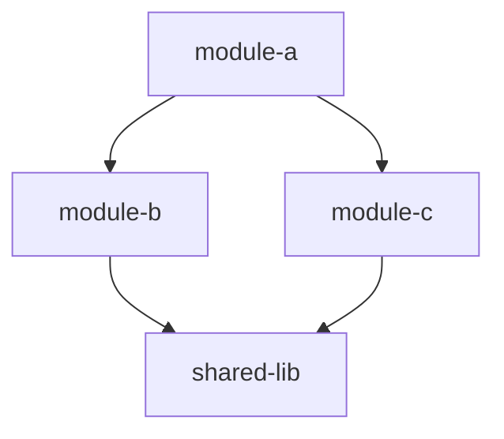
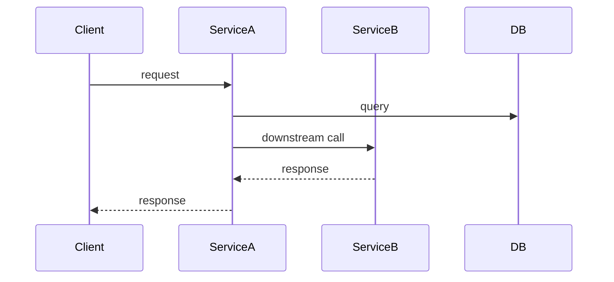

# Task: [Topic or Ticket ID]

## Summary
[One paragraph: what this task is about and what areas of the codebase are involved]

## Code Map

| File | Purpose | Needs Changes |
|------|---------|---------------|
| `path/to/file.go` | Brief description | yes/no/maybe |

## Data Flow

[Text description of the flow with file:line references]

## Dependency Chain

[Upstream and downstream dependencies with file:line references]

## Interaction Sequence

[Only include if multiple services/components interact.
 Describe protocols, sync/async, error handling.]

## Interface Boundaries

| Boundary | Type | Contract |
|----------|------|----------|
| `ServiceA → ServiceB` | gRPC | `proto/service.proto:L42` |

## Test Coverage

| Area | Tests | Gaps |
|------|-------|------|
| `path/to/code.go` | `path/to/code_test.go` | Missing edge case X |

## Risks & Gotchas
- [Concrete risks discovered during research]

## Open Questions
- [Questions that affect the approach and need discussion before /spec]
